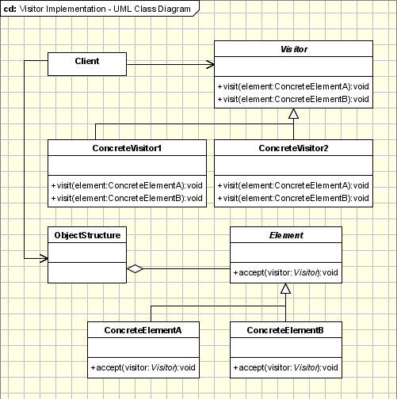

# Visiteur

Propriétaire: Valentin

# **Visiteur :**

Le modèle de conception Visiteur est un patron de conception comportemental permettant de renforcer la séparation de l’algorithme d’une application de la structure d’objet de celle-ci, permettant lors de l’application de ce modèle de conception de pouvoir ajouter de nouvelles opérations sur des classes et cela sans modifier la structure de celle-ci à chaque fois pour implémenter ces opérations, favorisant ainsi **l'extensibilité** du code.

# Motivation / Pourquoi l’utiliser ?

L’un des intérêts principaux d’utiliser le modèle Visiteur et lors de l’utilisation de Collections telles que des listes ou des piles. En effet, généralement des collections peuvent utiliser des objets de différents types et parfois il est nécessaire de réaliser des opérations sur les objets d’une collection et cela sans connaître le type précis de l’objet.

On pourrait réaliser ces opérations sur des objets de différents types en implémentant une série d’instruction conditionnelles ‘if’ vérifiant si un objet est une instance particulière d’une classe et cela pour les types de classes contenus dans la collection. 

Mais cette méthode n’est pas du tout recommandé car elle manque de flexibilité et ne respecte pas le [principe ouvert/fermé](https://fr.wikipedia.org/wiki/Principe_ouvert/ferm%C3%A9) (il est nécessaire de modifier du code déjà écrit à chaque ajout ou suppression d’un nouveau type dans la collection par exemple).

C’est là qu’il est pertinent d’utiliser le modèle Visiteur car l’utilisation de ce modèle de conception nous évitera la modification de classes déjà existantes et l’usage répétés d’instructions conditionnelles.

# Fonctionnement / Comment l’implémenter ?

## Classes et Interfaces Participantes



- **Visitable :** Une interface déclarant l’opération **`accept(visitor : Visitor)`**  permettant à des visiteurs de pouvoir visiter la classe et d’effectuer des opérations avec les attributs de celle-ci.
- **Éléments :** Dans le contexte du modèle de conception Visiteur, les éléments sont les objets de la structure de données sur lesquels vous souhaitez appliquer des opérations spécifiques. Ces opérations sont définies par l'objet de classe Visiteur Concret et chaque type d'élément doit être conçu de manière à accepter les visiteurs en implémentant Visitable.
    - **Exemple :** Une liste contenant des objets de classe  **`Circle`,`Square`** et tout autres objets héritant de la classe abstraite **`Shape`.**
- **Visiteur :** Une interface ou classe abstraite déclarant toutes les opérations de visites pour les types de classes implémentant Visitable. Généralement le nom de ces opérations est le même et elles sont seulement différenciés par les paramètres prises par celle-ci.
    - **Exemple :** Dans l’interface Visiteur, vous pouvez trouver deux signatures de fonctions aux noms identiques mais avec des paramètres différents : **`visit(shape: Circle)`,`visit(shape: Square)`.**
    - Ces signatures pourront être reprises par les visiteurs concrets qui implémenteront les opérations à effectuer en fonction du type de l’objet pris en paramètre.
- **Visiteur Concret :** Un objet héritant ou implémentant de Visiteur qui définit les opérations à effectuer sur les éléments de la structure. Chaque fonction déclaré dans Visiteur devra être implémenté dans le Visiteur Concret.
    - **Exemple :** Un visiteur concret appelé **`CalculateurSurface`** implémente les deux méthodes vus précédemment pour calculer la surface selon la forme en paramètre.

## Double répartition

Le modèle de conception Visiteur utilise une technique nommé la **Double répartition** ou **Double dispatch** : cette technique intervient lors de l’appel de méthodes polymorphiques (dans notre cas, c’est la méthode **`visit()`**) permettant de déterminer quelle méthode appeler en fonction du type de l’objet passé en paramètre de la méthode polymorphique.

# **Avantages du Modèle de Conception Visiteur :**

- 1. **Séparation des Préoccupations :** Le modèle de conception Visiteur favorise une séparation claire des préoccupations en isolant les opérations spécifiques dans des classes visiteurs distinctes. Cela signifie que chaque visiteur est responsable d'une tâche particulière, ce qui facilite la compréhension, la maintenance et l'évolution du code.

- 2. **Extensibilité :** L'un des avantages les plus importants du modèle de conception Visiteur est son extensibilité. Il permet d'ajouter de nouvelles opérations sans modifier la structure des éléments visitables. Vous pouvez introduire de nouveaux visiteurs pour implémenter de nouvelles fonctionnalités sans affecter les classes existantes, ce qui rend le système plus flexible et adaptable aux changements.

- 3. **Réutilisation du Code :** Les classes visiteurs peuvent être réutilisées avec différentes structures d'objets. Par conséquent, une fois qu'un visiteur est implémenté pour effectuer une opération spécifique, il peut être utilisé sur différentes hiérarchies d'objets sans nécessiter de modifications majeures. Cela encourage la réutilisation du code, ce qui est bénéfique en termes d'efficacité et de maintenabilité.

- 4. **Facilitation des Tests :** En raison de la séparation des préoccupations, les tests peuvent être effectués de manière plus ciblée. Les tests pour chaque opération spécifique peuvent être écrits dans la classe visiteur correspondante, facilitant ainsi la vérification de la logique métier associée à chaque opération.

# Exemple


Nous souhaitons modéliser cette situation, un agent d’assurance fait du porte-à-porte dans tout les batîments d’une rue, il propose des contrats d’assurances adaptés :

- Si c’est une maison, il vend des assurances maladie pour chaque habitant de celle-ci.
- Si c’est une banque, il vend des assurances contre le vol d’or.
- Si c’est une usine, il vend des assurances contre le vol du bien produit par l’usine.

Tout d’abord, nous implémentons l’interface **Visitable** ainsi que les classes des Batîments qui constitueront la rue, en prenant soin de les faire implémenter Visitable :

```java
public interface Visitable {
    public void accept(Visitor v);
}

public class Building implements Visitable{
    private String name;
    private int floors;
    private String address;
    
    // constructeur, getters et setters

    @Override
    public void accept(Visitor v) {
        v.visit(this);
    }
}

public class Bank extends Building {
		// constructeur, getters et setters

    @Override
    public void accept(Visitor v) {
        v.visit(this);
    }
}

public class Factory extends Building{
    private String product;

		// constructeur, getters et setters

    @Override
    public void accept(Visitor v) {
        v.visit(this);
    }
}

public class House extends Building{
    private int inhabitants;

		// constructeur, getters et setters

    @Override
    public void accept(Visitor v) {
        v.visit(this);
    }
}
```

Nous pouvons ensuite implémenter la classe abstraite **Visitor**, nous y écrirons une signature de méthode adapté à chaque classe implémentant **Visitable**, les classes qui hériteront de **Visitor** pourront ainsi implémenter les méthodes selon leurs besoins : 

```java
public abstract class Visitor {
    public abstract void visit(Building building);
    public abstract void visit(Bank building);
    public abstract void visit(Factory building);
    public abstract void visit(House building);
}
```

Nous pouvons maintenant implémenter la classe Visiteur Agent d’Assurance, et implémenter les méthodes pour qu’il puisse vendre une assurance adapté au bâtiment qu’il visite : 

```java
public class InsuranceAgent extends Visitor{
    private String name;

		// constructeurs  
	
    @Override
    public void visit(Building building) {
        return;
    }

    @Override
    public void visit(Bank building) {
        System.out.println(this.name + " a vendu une assurance contre le vol d'or au " + building.getAddress() + " pour " + building.getName() + ".");
    }

    @Override
    public void visit(Factory building) {
        System.out.println(this.name + " a vendu une assurance contre le vol de " + building.getProduct() + " au " + building.getAddress() + " pour " + building.getName() + ".");
    }

    @Override
    public void visit(House building) {
        System.out.println(this.name + " a vendu " + building.getInhabitants() + " assurances maladies au " + building.getAddress() + " pour " + building.getName() + ".");
    }
}
```

Enfin, nous pouvons dans la classe Main modéliser la situation en créant une Collections de *Buildings* représentant une rue ainsi qu’une Agent d’Assurance du nom de M. Paul qui parcourra cette rue pour vendre des assurances : 

```java
public class Main {
    public static void main(String[] args) {
        // Déclaration de la rue
        ArrayList<Building> street = new ArrayList<>();
        street.add(new House("Maison de M. Paul",1,"1 rue de la Belle Rue",5));
        street.add(new Factory("Usine de Bananes 'Banania'",6,"2 rue de la Belle Rue","banane"));
        street.add(new Bank("Banque LCL de la Belle Rue",3,"3 rue de la Belle Rue"));

        // Déclaration de l'agent d'assurance
        InsuranceAgent agent = new InsuranceAgent("Monsieur Paul");

        // L'agent d'assurance fait du porte à porte
        for (Building building : street){
            building.accept(agent);
        }
    }
}
```

Le résultat de cette modélisation que l’agent vend bel et bien une assurance adapté en fonction du batîment qu’il visite :

```bash
Monsieur Paul a vendu 5 assurances maladies au 1 rue de la Belle Rue pour Maison de M. Paul.
Monsieur Paul a vendu une assurance contre le vol de banane au 2 rue de la Belle Rue pour Usine de Bananes 'Banania'.
Monsieur Paul a vendu une assurance contre le vol d'or au 3 rue de la Belle Rue pour Banque LCL de la Belle Rue.
```

# Note et références

1. [https://fr.wikipedia.org/wiki/Patron_de_conception](https://fr.wikipedia.org/wiki/Patron_de_conception)
2. [https://refactoring.guru/fr/design-patterns/visitor](https://refactoring.guru/fr/design-patterns/visitor)
3. [https://fr.wikipedia.org/wiki/Visiteur_(patron_de_conception)](https://fr.wikipedia.org/wiki/Visiteur_(patron_de_conception))
4. [https://boowiki.info/art/modele/les-modeles-de-conception.html](https://boowiki.info/art/modele/les-modeles-de-conception.html)
5. [https://www.oodesign.com/visitor-pattern](https://www.oodesign.com/visitor-pattern)
6. [Design Patterns : Elements of Reusable Object-Oriented Software](https://archive.org/details/designpatternsel00gamm/page/331)
7. [https://refactoring.guru/fr/design-patterns/visitor-double-dispatch](https://refactoring.guru/fr/design-patterns/visitor-double-dispatch)